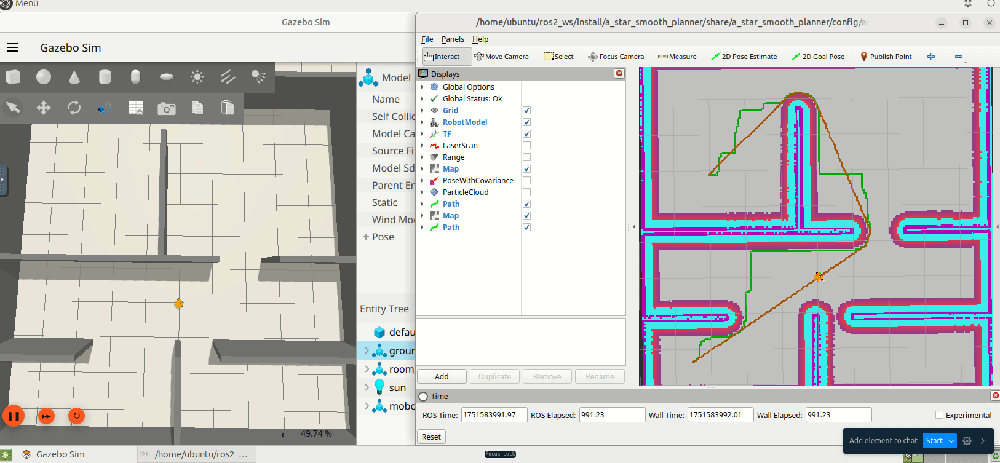

## AStar Smooth Planner (ROS2 Jazzy)


As the name implies, this is an imporved AStar Planner That produces straight smoothened path with minimal turns.
it is optimized for getting the shortest possible path. It builds on the AStar Algorithm

#

### Setup the AStar Smooth Planner
- ensure you have created your ros workspace
- clone and install the [MoboBot](https://github.com/robocre8/mobo_bot) Robot Package to Test the Planner
  ```shell
  git clone -b jazzy https://github.com/robocre8/mobo_bot.git
  ```
- clone the a_star_smooth_planner package
  ```shell
  git clone https://github.com/samuko-things/a_star_smooth_planner.git
  ```

> NOTE: you might need to make the `a_star_planner.py` and `a_star_smoother.py` executable

- cd into the root directory of your ros workspace and run rosdep to install all necessary ROS  package dependencies
  ```shell
  rosdep update
  rosdep install --from-paths src --ignore-src -r -y
  ```

- Build your mobo_bot_ws
  ```shell
  colcon build --symlink-install
  ```

#

### Test the AStar Smooth Planner
- start the MoboBot simulation (don't forget to source your ros workspace)
  ```shell
  ros2 launch mobo_bot_sim sim.launch.py
  ```
- start the a_star_smooth_planner with pure_pursuit controller and some navigation.
  ```shell
  ros2 launch a_star_smooth_planner nav_test.launch.py
  ```

- use the **2D GoalPose** button in RVIZ to move the robot from point to point and see the planner at work.


📚 Resources:
- [Self-Driving Planning Course](https://www.udemy.com/share/10d4U53@J5jcGUgRzDALXhLAGOMWxU6dAnWoZ-g8zGFl1djv_uJFHfRN5X0qLnnhFUJ_xl7J/) by Antonio Brandi
- [Improved AStar](https://www.sciencedirect.com/science/article/pii/S2468227621003690) by Dr. Oluwaseun Martins
- [MoboBot](https://github.com/robocre8/mobo_bot) – developed by me under [robocre8](https://github.com/robocre8)