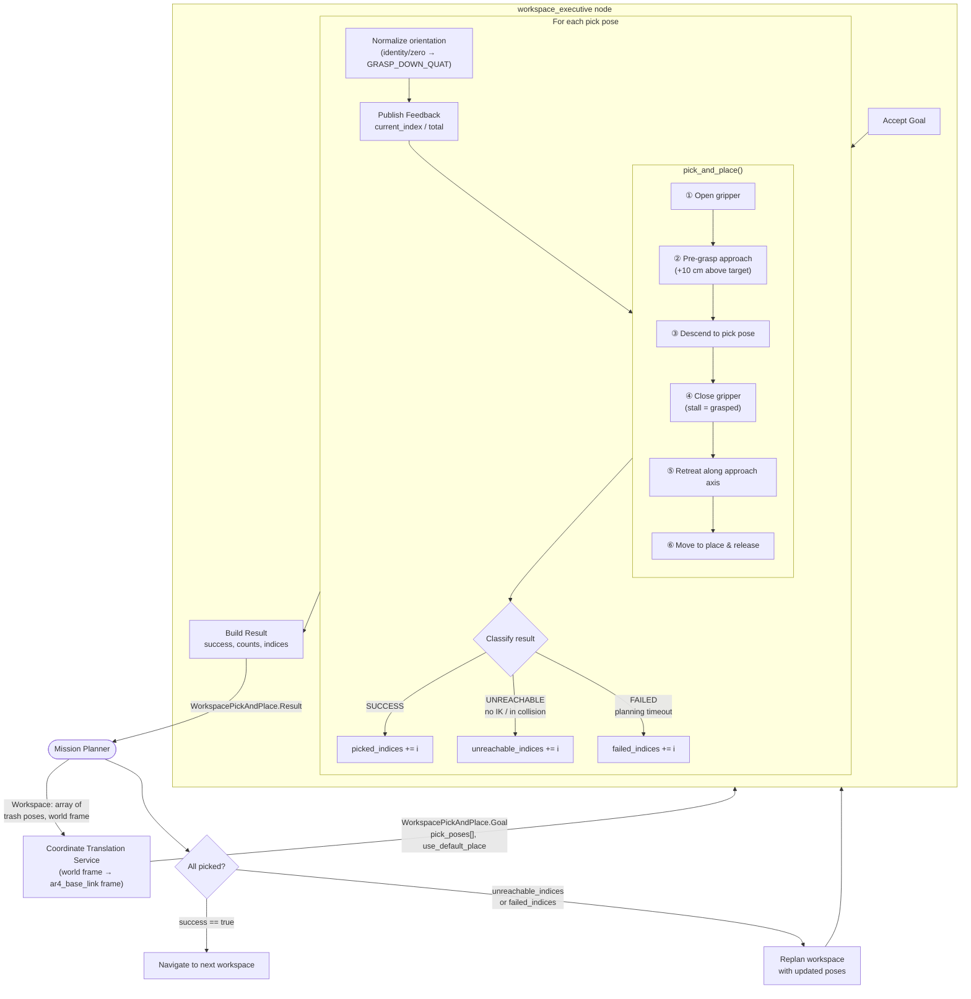

# Workspace Manipulation Pipeline

This document describes the pick-and-place pipeline from workspace delivery to physical manipulation, and provides usage instructions for the workspace executive action server.

---

## Architecture Flow



---

## Failure Classification

| Result field | Cause | Mission planner action |
|---|---|---|
| `unreachable_indices` | No IK solution, goal in collision, or outside joint limits | Reposition robot or replan pose angles |
| `failed_indices` | Planning timeout, OMPL failure, transient error | Retry same poses or replan workspace |
| `success: true` | All items picked and placed | Proceed to next workspace |

---

## Cancellation

If the mission planner cancels the goal mid-sequence (e.g., to navigate away):

1. The current pick-and-place cycle runs to completion
2. The gripper opens
3. The arm returns to the home pose
4. A partial result is returned with counts up to the cancellation point

---

## Running the Stack

### Terminal 1 — Simulation

```bash
source ~/ros2_ws/TPR/install/setup.bash
ros2 launch jackal_ar4_description gazebo.launch.py
```

Wait for all three controllers to appear active:

```bash
ros2 control list_controllers
# joint_state_broadcaster   active
# arm_controller            active
# ar_gripper_controller     active
```

### Terminal 2 — Workspace Executive

```bash
source ~/ros2_ws/TPR/install/setup.bash
ros2 run jackal_ar4_goals workspace_executive
```

### Terminal 3 — Send a Workspace Goal

#### Minimal (position only, gripper points down by default)

```bash
ros2 action send_goal --feedback /workspace_pick_and_place \
  jackal_ar4_interfaces/action/WorkspacePickAndPlace \
  "{
    pick_poses: [
      {position: {x: 0.38, y: -0.15, z: -0.1}},
      {position: {x: 0.45, y:  0.05, z: -0.1}},
      {position: {x: 0.32, y:  0.18, z: -0.1}}
    ],
    use_default_place: true
  }"
```

#### With explicit place pose

```bash
ros2 action send_goal --feedback /workspace_pick_and_place \
  jackal_ar4_interfaces/action/WorkspacePickAndPlace \
  "{
    pick_poses: [
      {position: {x: 0.40, y: 0.0, z: -0.1}}
    ],
    place_pose: {position: {x: -0.3, y: 0.05, z: 0.2}},
    use_default_place: false
  }"
```

#### With full 6-DOF pick orientation

```bash
ros2 action send_goal --feedback /workspace_pick_and_place \
  jackal_ar4_interfaces/action/WorkspacePickAndPlace \
  "{
    pick_poses: [
      {position: {x: 0.40, y: 0.0, z: -0.1},
       orientation: {x: 0.707, y: 0.707, z: 0.0, w: 0.0}}
    ],
    use_default_place: true
  }"
```

---

## Orientation Convention

| Orientation sent | Behaviour |
|---|---|
| Omitted (ROS default `w=1`) | `GRASP_DOWN_QUAT` substituted — gripper points straight down |
| All zeros `(0,0,0,0)` | `GRASP_DOWN_QUAT` substituted |
| Any other quaternion | Used as-is for the 6-DOF approach direction |

---

## Programmatic Usage (Python)

```python
import rclpy
from rclpy.action import ActionClient
from rclpy.node import Node
from geometry_msgs.msg import Pose, Point
from jackal_ar4_interfaces.action import WorkspacePickAndPlace

class WorkspaceClient(Node):
    def __init__(self):
        super().__init__('workspace_client')
        self._client = ActionClient(
            self, WorkspacePickAndPlace, 'workspace_pick_and_place'
        )

    def send_workspace(self, positions):
        goal = WorkspacePickAndPlace.Goal()
        goal.use_default_place = True
        for x, y, z in positions:
            p = Pose()
            p.position = Point(x=x, y=y, z=z)
            # orientation omitted → executive substitutes GRASP_DOWN_QUAT
            goal.pick_poses.append(p)

        self._client.wait_for_server()
        future = self._client.send_goal_async(goal)
        # ... await and inspect result.unreachable_indices / result.failed_indices


rclpy.init()
node = WorkspaceClient()
node.send_workspace([(0.38, -0.15, -0.1), (0.45, 0.05, -0.1), (0.32, 0.18, -0.1)])
```

---

## Key Packages

| Package | Role |
|---|---|
| `jackal_ar4_interfaces` | `WorkspacePickAndPlace.action` definition |
| `jackal_ar4_goals` | `workspace_executive` node and `pick_and_place` library |
| `jackal_ar4_moveit_config` | `arm_controller`, `ar_gripper_controller` configuration |
| `jackal_ar4_description` | URDF, launch files, simulation entry point |
